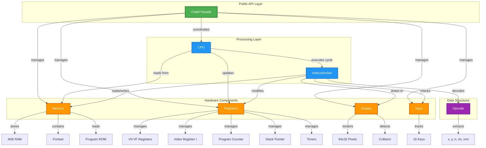
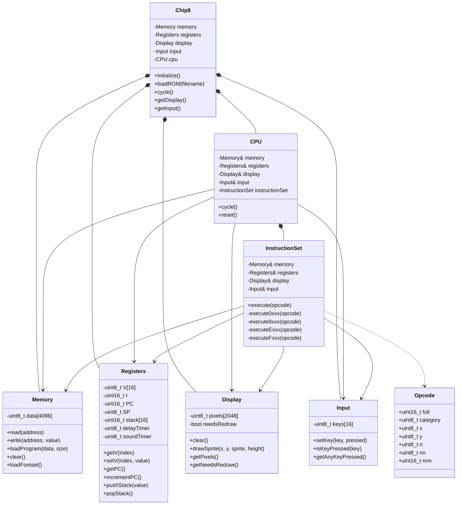
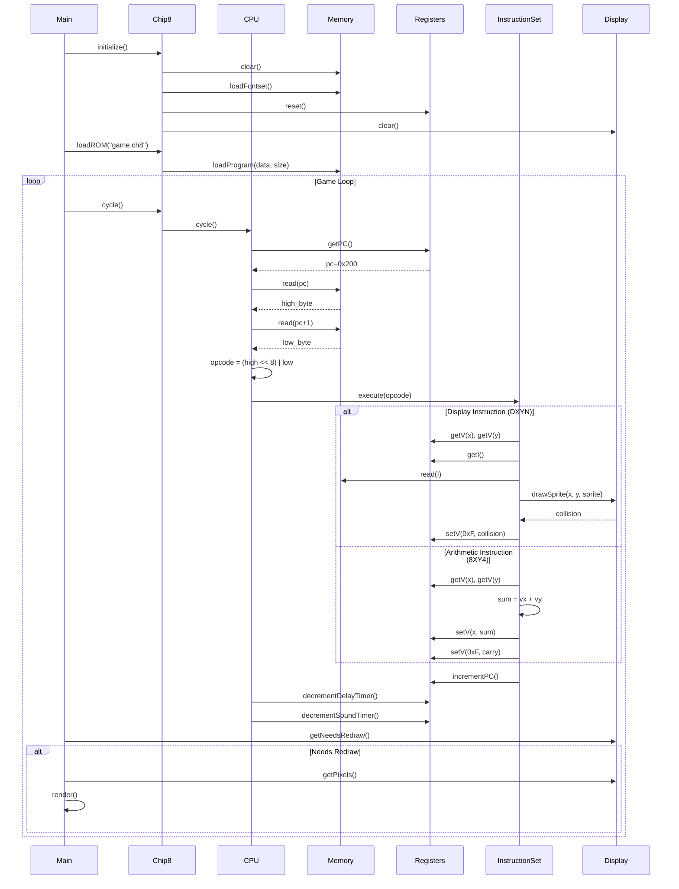
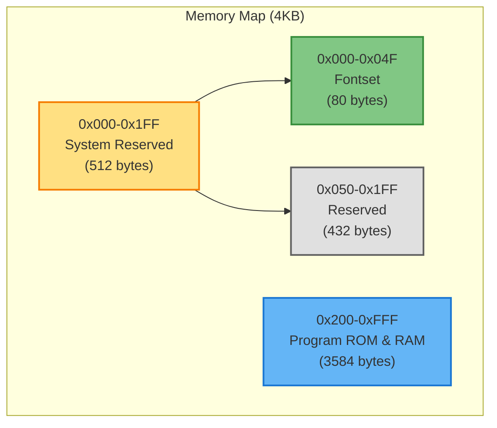
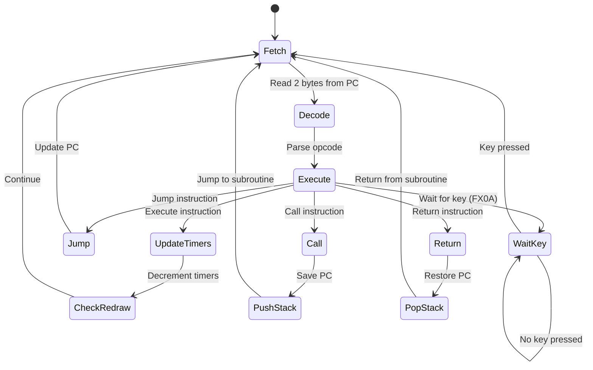
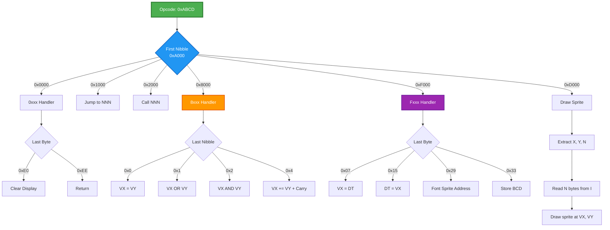
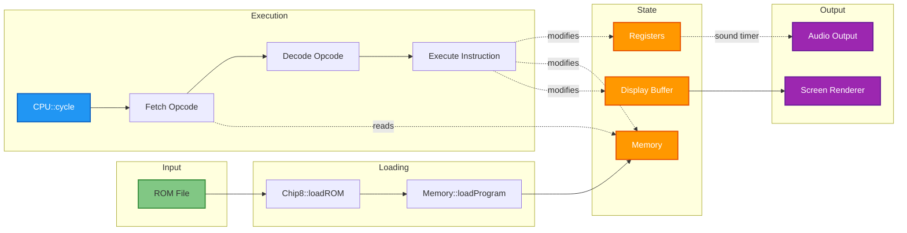
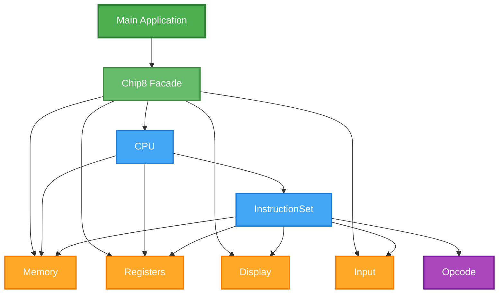

# CHIP-8 ISA Emulator
A modular, educational CHIP-8 Instruction Set Architecture emulator written in modern C++. This project demonstrates clean architecture principles, separation of concerns, and best practices in systems programming.

# CHIP-8 ISA Emulator

[](https://opensource.org/licenses/MIT)
[](https://isocpp.org/)
[](CONTRIBUTING.md)

## Table of Contents

- [Overview](#overview)
- [Architecture](#architecture)
- [Components](#components)
- [Building](#building)
- [Usage](#usage)
- [Technical Details](#technical-details)
- [Development Roadmap](#development-roadmap)
- [Resources](#resources)

## Overview

CHIP-8 is an interpreted programming language developed in the mid-1970s for early microcomputers. This emulator faithfully reproduces the CHIP-8 virtual machine with a focus on:

- **Modularity**: Each system component is isolated and independently testable
- **Extensibility**: Easy to add new features (debugger, save states, different backends)
- **Educational Value**: Clear code structure perfect for learning emulation concepts
- **Clean Code**: Modern C++ practices with clear interfaces and minimal coupling

### Specifications

- **Memory**: 4KB RAM (4096 bytes)
- **Display**: 64x32 monochrome pixels
- **Registers**: 16 general-purpose 8-bit registers (V0-VF)
- **Stack**: 16 levels for subroutine calls
- **Instruction Set**: 35 opcodes
- **Timers**: 60Hz delay and sound timers
- **Input**: 16-key hexadecimal keypad

## Architecture

The emulator follows a layered architecture with clear separation of concerns:

```
┌─────────────────────────────────────┐
│          Chip8 (Facade)             │  ← Public API
├─────────────────────────────────────┤
│              CPU                    │  ← Fetch-Decode-Execute
├─────────────────────────────────────┤
│        InstructionSet               │  ← Opcode Implementation
├──────────┬──────────┬───────────────┤
│  Memory  │ Registers│   Display     │  ← Hardware Components
│          │          │               │
│  Input   │  Opcode  │               │
└──────────┴──────────┴───────────────┘
```

### Design Principles

1. **Single Responsibility**: Each class has one well-defined purpose
2. **Dependency Injection**: Components receive dependencies through constructors
3. **Interface Segregation**: Minimal, focused public interfaces
4. **Open/Closed**: Easy to extend without modifying core components

## Components

### 1. Memory Module (`Memory.h`)

Manages the 4KB address space of the CHIP-8 system.

**Responsibilities:**
- RAM storage and access control
- Fontset loading (built-in sprites for hexadecimal digits 0-F)
- Program loading starting at address 0x200
- Address bounds checking

**Key Methods:**
```cpp
uint8_t read(uint16_t address)           // Read byte from memory
void write(uint16_t address, uint8_t val) // Write byte to memory
bool loadProgram(const uint8_t* data, size_t size)
```

**Memory Map:**
```
0x000-0x1FF: Reserved (interpreter, fontset)
0x200-0xFFF: Program ROM and work RAM
```

### 2. Display Module (`Display.h`)

Handles the 64x32 pixel monochrome display buffer.

**Responsibilities:**
- Pixel buffer management
- Sprite drawing with XOR logic
- Collision detection (VF flag)
- Redraw flag management

**Key Methods:**
```cpp
void clear()                              // Clear all pixels
bool drawSprite(uint8_t x, uint8_t y,     // Draw sprite, return collision
                const uint8_t* sprite, 
                uint8_t height)
const uint8_t* getPixels()                // Get framebuffer
```

**Display Characteristics:**
- XOR-based drawing (sprite XOR existing pixels)
- Wraps around screen edges
- Collision sets VF register to 1

### 3. Registers Module (`Registers.h`)

Centralized CPU state management.

**Responsibilities:**
- 16 general-purpose registers (V0-VF)
- Index register (I) for memory operations
- Program Counter (PC) tracking
- Stack Pointer (SP) and 16-level stack
- Delay and sound timers

**Key Methods:**
```cpp
uint8_t getV(uint8_t index)              // Get register Vx
void setV(uint8_t index, uint8_t value)  // Set register Vx
uint16_t getPC()                         // Get program counter
void pushStack(uint16_t value)           // Push to stack
uint16_t popStack()                      // Pop from stack
```

**Special Registers:**
- **VF**: Used for flags (carry, borrow, collision)
- **I**: 16-bit address register
- **PC**: Points to current instruction
- **SP**: Stack pointer for subroutines

### 4. Input Module (`Input.h`)

Manages the 16-key hexadecimal keypad state.

**Responsibilities:**
- Key state tracking (pressed/released)
- Key press queries
- Blocking key wait support

**Key Methods:**
```cpp
void setKey(uint8_t key, bool pressed)   // Set key state
bool isKeyPressed(uint8_t key)           // Check if key is down
int getAnyKeyPressed()                   // Get any pressed key (-1 if none)
```

**Keypad Layout:**
```
1 2 3 C
4 5 6 D
7 8 9 E
A 0 B F
```

### 5. Opcode Structure (`Opcode.h`)

Decodes 16-bit instructions into usable components.

**Responsibilities:**
- Automatic opcode parsing
- Extracting instruction parameters
- Providing named access to opcode fields

**Structure:**
```cpp
struct Opcode {
    uint16_t full;    // Complete opcode (0x1234)
    uint8_t category; // First nibble (0x1000)
    uint8_t x;        // Second nibble (0x0100)
    uint8_t y;        // Third nibble (0x0010)
    uint8_t n;        // Fourth nibble (0x0001)
    uint8_t nn;       // Last byte (0x0012)
    uint16_t nnn;     // Last 3 nibbles (0x0123)
};
```

**Example:**
```
Opcode: 0x8124
category = 0x8
x = 0x1
y = 0x2
n = 0x4
```

### 6. InstructionSet Module (`InstructionSet.h/cpp`)

Implements all 35 CHIP-8 instructions.

**Responsibilities:**
- Opcode execution logic
- ALU operations (arithmetic, logic, shifts)
- Memory operations
- Flow control (jumps, calls, returns)
- Display operations

**Instruction Categories:**

**0x0NNN - System/Display:**
- `00E0`: Clear display
- `00EE`: Return from subroutine

**0x1NNN - Flow Control:**
- `1NNN`: Jump to address NNN
- `2NNN`: Call subroutine at NNN

**0x3XNN - 0x5XY0 - Conditionals:**
- `3XNN`: Skip if VX == NN
- `4XNN`: Skip if VX != NN
- `5XY0`: Skip if VX == VY

**0x6XNN - 0x7XNN - Immediate:**
- `6XNN`: Set VX = NN
- `7XNN`: Add NN to VX

**0x8XYN - Arithmetic/Logic:**
- `8XY0`: VX = VY
- `8XY1`: VX |= VY (OR)
- `8XY2`: VX &= VY (AND)
- `8XY3`: VX ^= VY (XOR)
- `8XY4`: VX += VY (with carry)
- `8XY5`: VX -= VY (with borrow)
- `8XY6`: VX >>= 1 (shift right)
- `8XY7`: VX = VY - VX
- `8XYE`: VX <<= 1 (shift left)

**0x9XY0 - Conditional:**
- `9XY0`: Skip if VX != VY

**0xANNN - Memory:**
- `ANNN`: Set I = NNN

**0xBNNN - Flow:**
- `BNNN`: Jump to NNN + V0

**0xCXNN - Random:**
- `CXNN`: VX = random() & NN

**0xDXYN - Display:**
- `DXYN`: Draw sprite at (VX, VY), height N

**0xEXNN - Input:**
- `EX9E`: Skip if key VX is pressed
- `EXA1`: Skip if key VX is not pressed

**0xFXNN - Special:**
- `FX07`: VX = delay_timer
- `FX0A`: Wait for key press, store in VX
- `FX15`: delay_timer = VX
- `FX18`: sound_timer = VX
- `FX1E`: I += VX
- `FX29`: I = sprite_address[VX]
- `FX33`: Store BCD of VX at I, I+1, I+2
- `FX55`: Store V0-VX in memory starting at I
- `FX65`: Load V0-VX from memory starting at I

### 7. CPU Module (`CPU.h`)

Orchestrates the fetch-decode-execute cycle.

**Responsibilities:**
- Instruction fetching from memory
- Opcode decoding
- Delegating execution to InstructionSet
- Timer management (60Hz decrement)

**Cycle Execution:**
```cpp
void cycle() {
    // 1. Fetch: Read 2 bytes from PC
    uint16_t opcode = (memory[PC] << 8) | memory[PC+1];
    
    // 2. Decode: Parse opcode
    Opcode op(opcode);
    
    // 3. Execute: Run instruction
    instructionSet.execute(op);
    
    // 4. Update timers
    decrementTimers();
}
```

### 8. Chip8 Facade (`Chip8.h`)

Main interface for using the emulator.

**Responsibilities:**
- System initialization
- ROM loading
- Coordinating all components
- Providing simplified public API

**Key Methods:**
```cpp
void initialize()                        // Reset all components
bool loadROM(const char* filename)       // Load ROM file
void cycle()                             // Execute one CPU cycle
const Display& getDisplay()              // Access display buffer
Input& getInput()                        // Access input system
```

## 🔨 Building

### Prerequisites

- C++11 or later compiler (GCC, Clang, MSVC)
- CMake 3.10+ (optional, for build automation)

### Compilation

**Manual Compilation:**
```bash
g++ -std=c++11 -o chip8-emu main.cpp -I./include
```

**With CMake:**
```bash
mkdir build && cd build
cmake ..
make
```

### Project Structure

```
chip8-isa-emulator/
├── include/
│   ├── Memory.h
│   ├── Display.h
│   ├── Registers.h
│   ├── Input.h
│   ├── Opcode.h
│   ├── InstructionSet.h
│   ├── CPU.h
│   └── Chip8.h
├── src/
│   ├── InstructionSet.cpp
│   └── main.cpp
├── roms/                    # Test ROMs
├── tests/                   # Unit tests
├── CMakeLists.txt
└── README.md
```

## Usage

### Basic Usage

```cpp
#include "Chip8.h"

int main() {
    Chip8 emulator;
    emulator.initialize();
    
    if(!emulator.loadROM("game.ch8")) {
        return 1;
    }
    
    // Main loop (pseudo-code)
    while(running) {
        emulator.cycle();           // Execute one instruction
        
        if(emulator.getDisplay().getNeedsRedraw()) {
            render();               // Update screen
        }
        
        handleInput();              // Process keyboard
        
        delay(1.0 / 500.0);        // ~500Hz cycle rate
    }
}
```

### Running Test ROMs

```bash
./chip8-emu roms/test_opcode.ch8
./chip8-emu roms/pong.ch8
./chip8-emu roms/space_invaders.ch8
```

## Technical Details

### Timing

- **CPU Speed**: ~500-700Hz (configurable)
- **Timers**: 60Hz (delay and sound)
- **Display**: Refresh on draw instructions

### Instruction Execution Time

All instructions execute in constant time (one cycle), except:
- `FX0A`: Blocks until key press

### Quirks and Compatibility

This emulator implements the original CHIP-8 behavior:
- Shift operations affect VX only (not VY)
- `FX55`/`FX65` leave I unchanged
- `8XY6`/`8XYE` shift VX (ignore VY)

### Random Number Generation

Uses `std::default_random_engine` seeded with system time for the `CXNN` instruction.

## 🛣️ Development Roadmap

### Core Features (Completed)
-  All 35 CHIP-8 opcodes
-  Modular architecture
-  Memory management
-  Display rendering
-  Input handling
-  Timer system

### Planned Extensions

**Phase 1: Graphics & Audio**
- [ ] SDL2 integration for display
- [ ] Audio output for sound timer
- [ ] Configurable display scaling

**Phase 2: Development Tools**
- [ ] Debugger with breakpoints
- [ ] Disassembler
- [ ] Memory viewer
- [ ] Register inspector

**Phase 3: Advanced Features**
- [ ] Save states
- [ ] Rewind functionality
- [ ] Recording/playback
- [ ] Performance profiling

**Phase 4: Extended Compatibility**
- [ ] SUPER-CHIP support (128x64)
- [ ] XO-CHIP extensions
- [ ] Configurable quirks modes

### Contribution Ideas

- Implement test suite with catch2/gtest
- Add CMake build system
- Create GUI frontend with ImGui
- Port to WebAssembly
- Add command-line debugger
- Implement different display backends (SFML, raylib)

## 📖 Resources

### CHIP-8 Documentation
- [Cowgod's CHIP-8 Technical Reference](http://devernay.free.fr/hacks/chip8/C8TECH10.HTM)
- [CHIP-8 Wikipedia](https://en.wikipedia.org/wiki/CHIP-8)
- [Mastering CHIP-8](http://mattmik.com/files/chip8/mastering/chip8.html)

### Test ROMs
- [chip8-test-suite](https://github.com/Timendus/chip8-test-suite)
- [CHIP-8 Games Pack](https://www.zophar.net/pdroms/chip8.html)

### Emulation Resources
- [Emulator Development Guide](http://www.emulator101.com/)
- [Writing an Emulator in C++](https://austinmorlan.com/posts/chip8_emulator/)

## License

This project is released under the MIT License. See LICENSE file for details.

## Acknowledgments

- Joseph Weisbecker for creating CHIP-8
- The emulation development community
- All CHIP-8 test ROM creators

---

**Note**: This is a core emulator implementation. For a complete, playable experience, integrate with a graphics library like SDL2 or SFML.

## 1. Component Architecture (High-Level)



## 2. Class Relationships (UML Style)



## 3. Execution Flow (Sequence Diagram)



## 4. Memory Layout



## 5. CPU Cycle (State Machine)



## 6. Instruction Decode Logic



## 7. Data Flow



## 8. Component Dependencies

